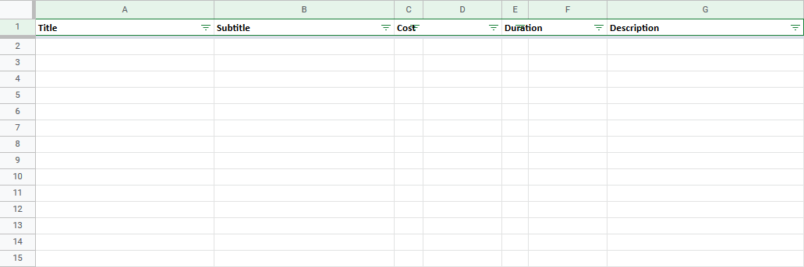

# Mildly Magical Inspiration
This is a module for Foundry VTT. It lets Gamemasters create card decks and hand those cards out to their players. It can be used as an alternative way to handout inspiration to players in D&amp;D 5th Edition.

## Usage
Install the module using the manifest url https://github.com/EvaTheDM/mildly-magical-inspiration/releases/latest/download/module.json or download the zip file [here](https://github.com/EvaTheDM/mildly-magical-inspiration/releases/latest/download/module.zip) and unpack it in your modules directory. When you log in as a gamemaster for the first time after activating the module you will be asked to set up the deck to be used. Afterwards the module is simple to use, allowing you to hand out cards to players at any time.

For players to use/return/pass a card a gamemaster needs to be logged into the game.

## Example Decks
`An example deck will be provided at a later time`

## Creating a Custom Deck
Creating a custom deck is very easy. It can either be done directly within Foundry VTT or within any programm capable of creating tables and exporting them as a `.csv` file. Here you can see what your table is meant to look like.

It is important to keep the column titles the same, as they are used to identify each entry. Both **cost** and **duration** need to be made up of two columns. The first one can be left empty or you can enter a number. The second one should be a string.

**Example**: `1 Action` as cost.
