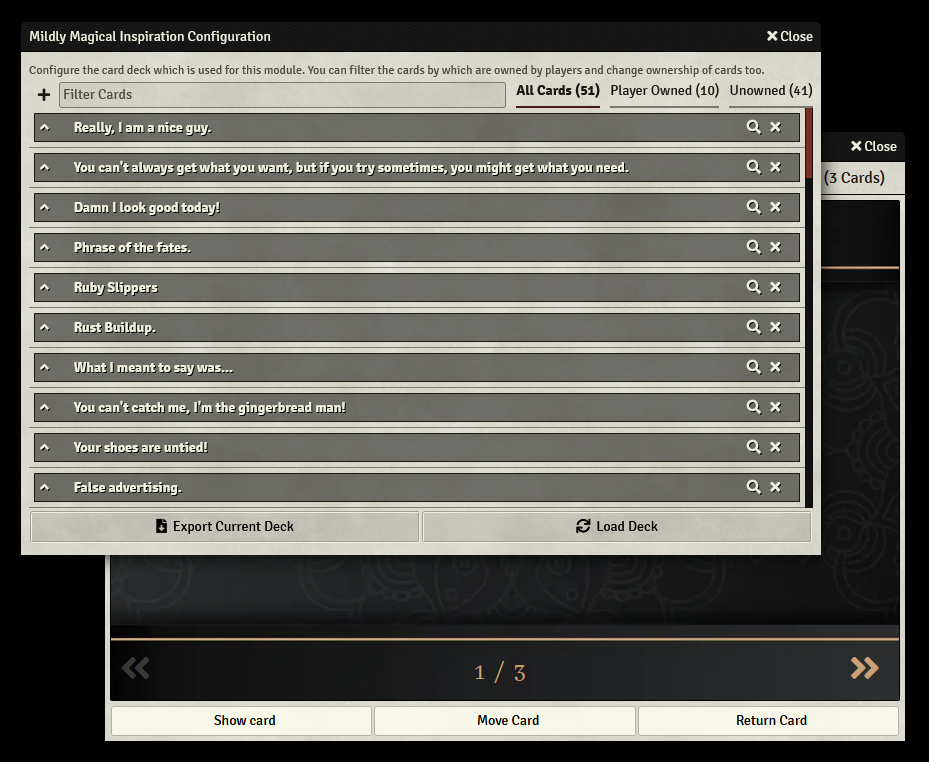

<!--
*** Thanks for checking out the Best-README-Template. If you have a suggestion
*** that would make this better, please fork the repo and create a pull request
*** or simply open an issue with the tag "enhancement".
*** Thanks again! Now go create something AMAZING! :D
-->

<!-- PROJECT LOGO -->
 

    

  <h3 align="center">Mildly Magical Inspiration</h3>

  

    This is a module for Foundry VTT. It allows Gamemasters to create card decks and hand those cards out to their players. It is meant to be used as an alternative way to handout inspiration to players in D&D 5th Edition.
     
    <!--<a href="https://github.com/othneildrew/Best-README-Template"><strong>Explore the docs »</strong></a>-->
     
     
    <a href="https://github.com/EvaTheDM/mildly-magical-inspiration/issues">Report Bug</a>
    ·
    <a href="https://github.com/EvaTheDM/mildly-magical-inspiration/issues">Request Feature</a>
  

<!-- TABLE OF CONTENTS -->

  
Table of Contents

  <ol>
    <li>
      <a href="#about-the-project">About The Project</a>
      <ul>
        <li><a href="#built-with">Built With</a></li>
      </ul>
    </li>
    <li>
      <a href="#getting-started">Getting Started</a>
      <ul>
        <li><a href="#installation">Installation</a></li>
        <li><a href="#setup">Setup</a></li>
        <li><a href="#creating-a-deck-using-google-sheets-or-similar">Creating a deck using Google Sheets or similar</li>
      </ul>
    </li>
    <li><a href="#usage">Usage</a></li>
    <li><a href="#roadmap">Roadmap</a></li>
    <li><a href="#license">License</a></li>
  </ol>

## About The Project

**Mildly Magical Inspiration** was created as a way to give players in D&D 5th Edition games something slightly more interesting than advantage as inspiration. Despite that the module can easily be adapted to any game system that uses some kind of reward system for players.

Here is what the module offers to you and your players:
* An easy to use interface for creating cards that offer specific mechanical and non-mechanical benefits to your players.
* Highly customizable options for how many cards players can hold at a time, how many they can choose from when you award them one and wether or not the card fronts are visible.
* Award cards as rewards to your players, wether they are currently online or not.

While the module is fully functional it is still in developement and improvements are always being made. The inspiration for this module comes from the [Deck of Dirty Tricks by Frog God Games](https://www.froggodgames.com/product/deck-of-dirty-tricks-vol-1/). Due to copyright reasons the module doesn't come with any content though I may develop sample content to be used by default in the future. Until then I can highly recommend getting one of the Decks from Frog God Games and filling the module up with those.

### Built With

The only requirement at this time ist for you to have Foundry VTT. Other than that the module doesn't rely on any other modules to function and is completely self contained.

## Getting Started

Getting started with this module is as simple as any other Foundry VTT module

### Installation

At this point **Mildly Magical Inspiration** cannot be found in the module browser in Foundry. It needs to be installed manually. To do so either download the module.zip (`https://github.com/EvaTheDM/mildly-magical-inspiration/releases/latest/download/module.zip`) and unpack it in your modules folder.

Alternatively go into your Foundry VTT setup and install the moduel with this manifest url direclty: `https://github.com/EvaTheDM/mildly-magical-inspiration/releases/latest/download/module.json`.

### Setup

When you first load your world after activating **Mildly Magical Inspiration** for the first time you will be lead through a quick setup.

1. Select `*.csv` or `*.json` files with the appropriate info from your hard drive.
2. Select one of these sources as the default deck.
3. Click the *Setup Mildly Magical Inspiration*-Button

### Creating a deck using Google Sheets or similar

This part of the guide will soon be updated...

## Usage

Using the module is extremly simple. Once you installed, activated and setup the module a small button will appear between the player list and the hotbar, at the bottom of your screen. This button is visible to both players and gamemasters.

For players the button has a left click functionality only. By clicking it they can open a view of all the cards currently in their hands. From that view they can show the cards to all or specific players (or the gamemaster) provided they are online, they can pass their card to another player (provided they still have space in their hand), or they can use their card.

Using a card removes it from the players hands and sends a message to chat, informing everyone about the title, subtitle and description of the card as well as Activation Cost and Effect Duration.

When gamemasters left click the deck icon they open up a view where they can switch between their players' hands, seeing all cards currently in the respective player's hand. Right clicking on the button opens a context menu that gives quick access to the deck configuration menu, recalling all cards, resetting the deck back to its original source material (effectively automaticall recalling all cards as well) or awarding cards to a player.

When awarding a card to player, simply choose the player's name and click award. If the player is online (and you have adjusted the settings so that players can choose between several different cards) a dialog will open for them, letting them choose between different cards.

If they are not online, the information will be saved and opens up the next time they go online.

Please be aware that for this module to work properly everything (with the exception of showing cards to others) requires a gamemaster to be loggeed in.

## Roadmap

See the [open issues](https://github.com/EvaTheDM/mildly-magical-inspiration/issues) for a list of proposed features (and known issues).

Additionally these are currently planned features for the module's future:

* Option to disable normal Inspiration and/or show number of cards in character sheet
* Safety features to avoid bugs from appearing when players try to use functions while no gamemaster is logged in
* Default Deck
* Dedicated in built card/deck creator
* QOL improvements
* Basic rework to change the cards/decks/sources to a factory function approach (will only affect things under the hood)
* Updating the guide with a how to create decks with google sheets or similar programs.

## License

Distributed under the MIT License. See `LICENSE` for more information.
