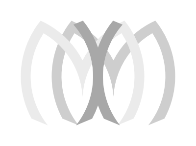
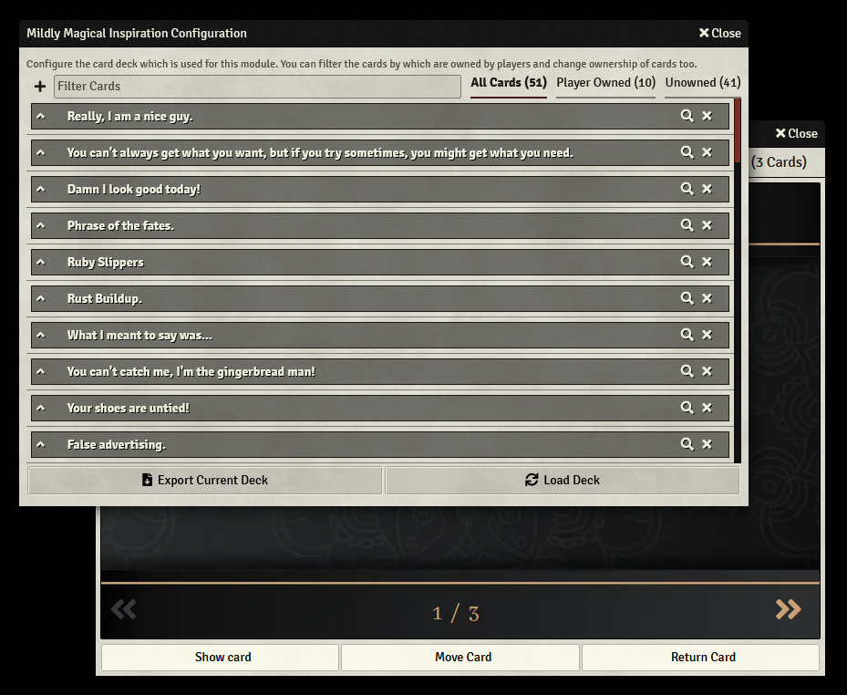

<!--
*** Thanks for checking out the Best-README-Template. If you have a suggestion
*** that would make this better, please fork the repo and create a pull request
*** or simply open an issue with the tag "enhancement".
*** Thanks again! Now go create something AMAZING! :D
-->

 

    

  <h3 align="center">Mildly Magical Inspiration</h3>

  

    This is a module for Foundry VTT. It allows Gamemasters to create card decks and hand those cards out to their players. It is meant to be used as an alternate way to handout inspiration to players in D&D 5th Edition but can easily be used for other use cases.
     
    <a href="https://github.com/EvaTheDM/mildly-magical-inspiration/wiki"><strong>&laquo; Explore the Wiki &raquo;</strong></a>
     
     
    <a href="https://github.com/EvaTheDM/mildly-magical-inspiration/issues/new?assignees=EvaTheDM&labels=bug&template=bug_report.md&title=%5BBUG%5D">Report Bug</a>
    ·
    <a href="https://github.com/EvaTheDM/mildly-magical-inspiration/issues/new?assignees=EvaTheDM&labels=enhancement&template=feature_request.md&title=%5BFEATURE%5D">Request Feature</a>
  

<!-- TABLE OF CONTENTS -->

  
Table of Contents

  <ol>
    <li>
      <a href="#about-the-project">About The Project</a>
      <ul>
        <li><a href="#built-with">Built With</a></li>
      </ul>
    </li>
    <li>
      <a href="#getting-started">Getting Started</a>
      <ul>
        <li><a href="#installation">Installation</a></li>
        <li><a href="#setup">Setup & Usage</a></li>
      </ul>
    </li>
    <li><a href="#roadmap">Roadmap</a></li>
    <li><a href="#license">License</a></li>
  </ol>

## About The Project

**Mildly Magical Inspiration** was created as a way to give players in D&D 5th Edition games something slightly more interesting than advantage as inspiration. Despite that the module can easily be adapted to any game system that uses some kind of reward system for players.

Here is what the module offers to you and your players:
* An easy to use interface for creating cards that offer specific mechanical and non-mechanical benefits to your players.
* Highly customizable both in what effects cards are meant to have as well as in how to use the module as a whole.
* Award cards as rewards to your players, wether they are currently online or not.

While the module is fully functional it is still in developement and improvements are always being made. The inspiration for this module comes from the [Deck of Dirty Tricks by Frog God Games](https://www.froggodgames.com/product/deck-of-dirty-tricks-vol-1/). I can highly recommend getting one of the Decks from Frog God Games and filling the module up with those. Otherwise with v.2.0.0 you can now find premade sources on the [Available Sources](https://github.com/EvaTheDM/mildly-magical-inspiration/wiki/Available-Sources)-wiki page. You can download them from there and use them directly in your Foundry!

### Built With

The only requirement at this time is for you to have Foundry VTT. Other than that the module doesn't rely on any other modules to function and is completely self contained.

## Getting Started

Getting started with this module is as simple as any other Foundry VTT module

### Installation

To install the module either install it directly from the module browser within Foundry or install it manually by downloading and unzipping the module.zip (`https://github.com/EvaTheDM/mildly-magical-inspiration/releases/latest/download/module.zip`) into your modules folder.

Alternatively go into your Foundry VTT setup and install the moduel with this manifest url direclty: `https://github.com/EvaTheDM/mildly-magical-inspiration/releases/latest/download/module.json`.

### Setup & Usage

When you first load your world after activating **Mildly Magical Inspiration** for the first time you will likely be shown the latest change log of the module. Upon clicking the getting started button the source config will open from where you can create a new source.

For details on this please visit the [Getting Started](https://github.com/EvaTheDM/mildly-magical-inspiration/wiki/Getting-Started) guide in the wiki.

## Roadmap

See the [open issues](https://github.com/EvaTheDM/mildly-magical-inspiration/issues) for a list of proposed features and known bugs. For a full planned roadmap you can visit the [project board roadmap](https://github.com/EvaTheDM/mildly-magical-inspiration/projects/1).

## Contact

If you have any further questions about using the module I'm a regular visitor of the Foundry Discord server where you can contact me under the discord handle **Eva#4821**.

## License

Distributed under the MIT License. See `LICENSE` for more information.
